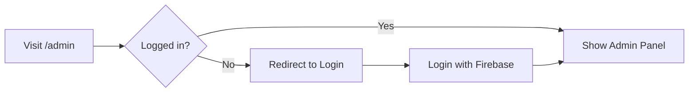

# 🔐 Hướng Dẫn Truy Cập Admin Panel

## ✅ Đã Setup Xong

Tôi đã setup routing cho admin panel. Bây giờ bạn có thể truy cập các trang admin.

---

## 🚀 Cách Vào Trang Admin

### **Bước 1: Đăng nhập**
1. Mở trình duyệt và truy cập: `http://localhost:5173`
2. Click vào button **"Login"** 
3. Đăng nhập bằng tài khoản Firebase của bạn

### **Bước 2: Truy cập Admin Panel**
Sau khi đã đăng nhập, có 2 cách:

#### **Cách 1: Nhập URL trực tiếp**
```
http://localhost:5173/admin
```
hoặc
```
http://localhost:5173/admin/dashboard
```

#### **Cách 2: Click vào sidebar menu**
- Sau khi vào admin panel, bạn sẽ thấy sidebar bên trái
- Click vào các menu items để navigate

---

## 📍 Các Routes Admin Có Sẵn

### ✅ **Đã Hoàn Thành:**
- `/admin` hoặc `/admin/dashboard` - **Admin Dashboard**
- `/admin/stores` - **Store Management** (CRUD stores)

### 🚧 **Coming Soon (Placeholder):**
- `/admin/menu` - Menu Management
- `/admin/orders` - Order Management  
- `/admin/ingredients` - Ingredient Management
- `/admin/users` - User Management
- `/admin/analytics` - Analytics Dashboard
- `/admin/settings` - Settings

---

## 🎨 Admin Layout Features

Khi vào admin panel, bạn sẽ thấy:

### **1. Sidebar (Bên trái)**
- Dashboard
- Stores ✅
- Orders
- Menu
- Ingredients
- Customers (Users)
- Reports
- Settings

### **2. Header (Trên cùng)**
- Breadcrumb navigation
- Current page title

### **3. Main Content Area**
- Nội dung của từng page

---

## 🔥 Quick Test

### **Test Store Management:**
```bash
1. Mở: http://localhost:5173/admin/stores
2. Bạn sẽ thấy:
   - List of stores with search
   - Stats cards (Total/Active/Inactive)
   - Add New Store button
   - Store cards với actions (Edit/Toggle/Delete)
```

### **Test Admin Dashboard:**
```bash
1. Mở: http://localhost:5173/admin/dashboard
2. Bạn sẽ thấy:
   - Revenue stats
   - Order stats
   - Charts
   - Recent sales
```

---

## 🛠️ Development Notes

### **Current Setup:**
```typescript
App.tsx:
✅ Admin routes nested under /admin
✅ Wrapped with ProtectedRoute (require auth)
✅ Using AdminLayout for consistent UI
✅ Outlet pattern for nested routes
```

### **File Structure:**
```
src/
├── pages/
│   └── admin/
│       ├── AdminDashboard.tsx ✅
│       ├── AdminDashboard-realtime.tsx
│       └── Stores.tsx ✅
│
├── layouts/
│   └── admin/
│       ├── AdminLayout.tsx ✅
│       └── admin-sidebar-data.ts ✅
│
└── App.tsx ✅ (Routes configured)
```

---

## 🔒 Authentication Flow



### **ProtectedRoute Logic:**
```typescript
- requireAuth={true} → Chỉ cho phép user đã login
- Nếu chưa login → redirect về trang chủ
- Nếu đã login → render admin content
```

---

## 💡 Next Steps

### **Priority Tasks:**
1. ✅ **Store Management** - DONE
2. 🔴 **Daily Menu Builder** - Cần làm ngay
3. 🔴 **Menu Items Management** - Quan trọng
4. 🔴 **Order Dashboard** - Real-time tracking

### **API Integration:**
```typescript
// Hiện tại đang dùng mock data
ENV.USE_MOCK_DATA = true

// Khi backend ready:
ENV.USE_MOCK_DATA = false
```

---

## 🐛 Troubleshooting

### **Vấn đề: "Cannot access /admin"**
✅ **Giải pháp:** Đã fix! Routes đã được thêm vào App.tsx

### **Vấn đề: "Redirect về trang chủ"**
⚠️ **Nguyên nhân:** Bạn chưa đăng nhập
✅ **Giải pháp:** Login trước khi vào /admin

### **Vấn đề: "Sidebar không hiện"**
⚠️ **Nguyên nhân:** AdminLayout chưa được wrap đúng
✅ **Giải pháp:** Đã fix trong routing

---

## 📞 Support

Nếu có lỗi, check:
1. Browser console (F12) - xem error logs
2. Network tab - xem API calls
3. React DevTools - xem component state

---

## 🎉 Summary

**BẠN BÂY GIỜ CÓ THỂ:**
✅ Truy cập `/admin` hoặc `/admin/dashboard`
✅ Xem Store Management tại `/admin/stores`
✅ Navigate qua sidebar
✅ Thấy layout admin đầy đủ
✅ Ready để develop thêm features!

**START DEV SERVER:**
```bash
npm run dev
```

**VÀO ADMIN:**
```
http://localhost:5173/admin
```
